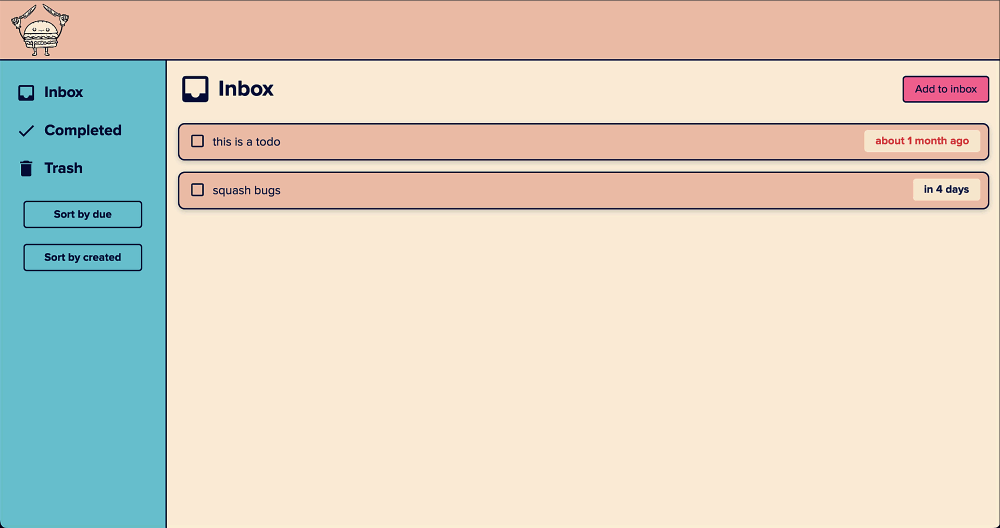
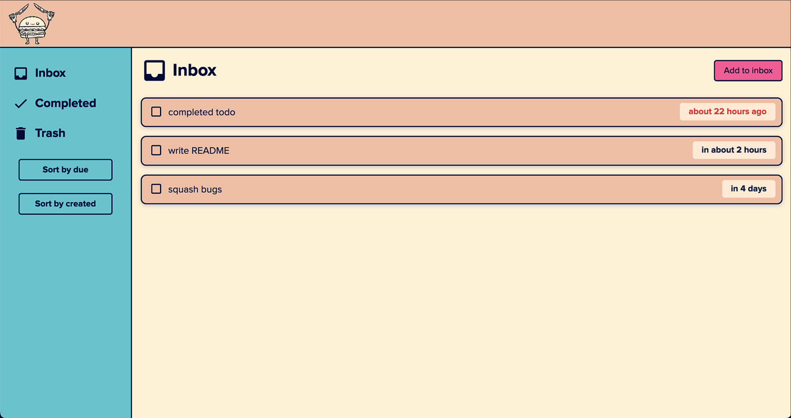
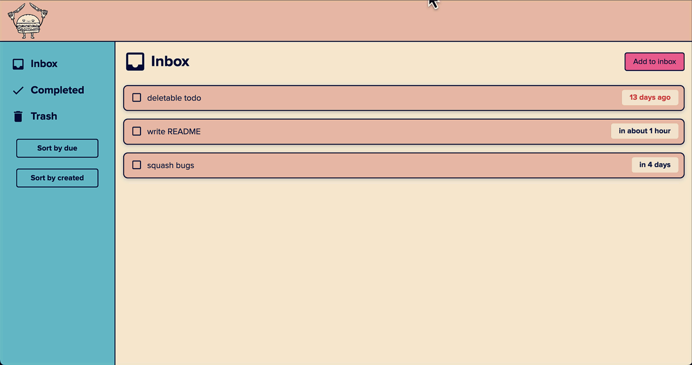
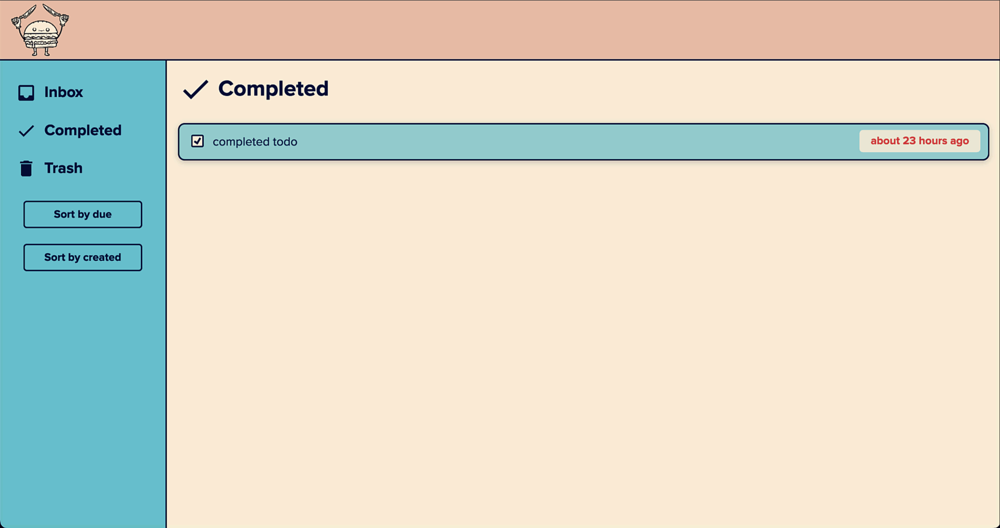
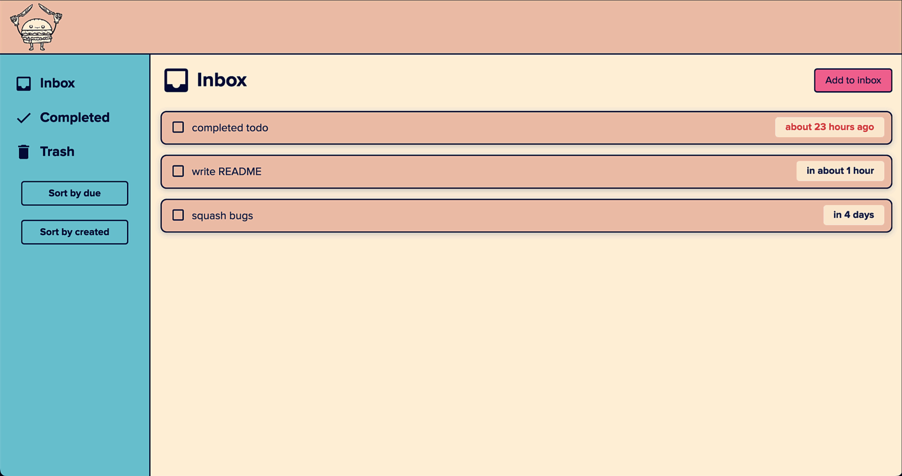
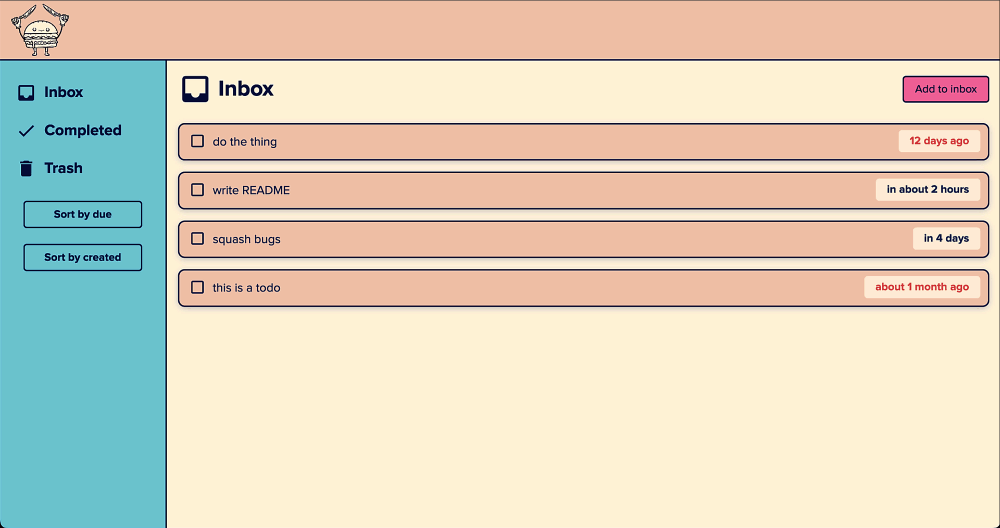

# *listless*

*listless* is a strongly-typed, minimalist todo list app.

Todos contain a title, description, due date, and priority. To create a new todo, select **Add to inbox**.

 When you've completed a todo, select the checkbox to send it to *Completed*.

To delete a todo, select the **trash icon**.

All todos are processed through your inbox. If you want to modify a todo, or move it to a different tab, you must first return it to your inbox. 

To un-complete a todo, go to *Completed*, then uncheck the todo you want to restore. 

To un-delete a todo, go to *Trash*, then select **Restore**. 

You can also drag and drop from *Inbox* to *Completed* or *Trash*, or from *Trash* or *Completed* back to *Inbox*.

To sort your *Inbox*, *Completed* or *Trash* by due date or created date, select the corresponding buttons from the left sidebar.

> :information_source: Your todos are saved to your browser's local storage, and will persist across sessions. Todos will be lost if you clear your cache.

## About this project
This project was written entirely in vanilla JS and CSS. The only external library used is [date-fns](https://date-fns.org/docs/Getting-Started), which helps convert due dates to strings.

This project was created for [The Odin Project](https://www.theodinproject.com/lessons/node-path-javascript-todo-list) to practice handling objects (modules, IIFEs, factory functions, and constructors).

This was my first time using NPM to manage project and dev dependences, as well as Webpack to create the SPA. 